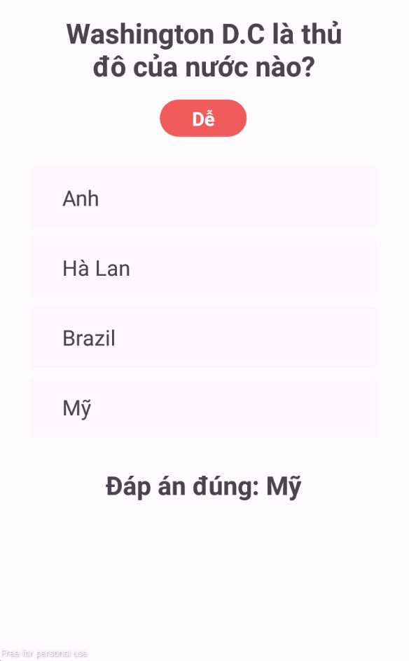

# GoQuizz

## Mô tả ứng dụng

- Ứng dụng cho phép người dùng có thể trả lời câu hỏi trắc nghiệm.
- Người dùng có thể chọn các chủ đề (Địa lý, Lịch sử, Khoa học, Nghệ thuật,...)
- Mỗi chủ đề có 2 cấp độ chơi: Dễ/Khó (Mỗi câu đúng ở mức dễ được 1 điểm, khó được 2 điểm)
- Lưu điểm qua toàn bộ các lần chơi của người dùng
- Xem toàn bộ câu hỏi của ứng dụng

## Công nghệ sử dụng

- Java 7
- Android Studio

## Một số hình ảnh ứng dụng

  

  <li>Màn hình chào mừng</li>
    
  

  
  

  <li>Màn hình chọn chủ đề / độ khó</li>
    
  

  

  <li>Màn hình trả lời câu hỏi</li>
    
  

  
  

  <li>Màn hình kết quả</li>
    
  

  

  <li>Màn hình danh sách câu hỏi</li>
    
  

  
  

  <li>Màn hình chi tiết câu hỏi + đáp án</li>
    
  

